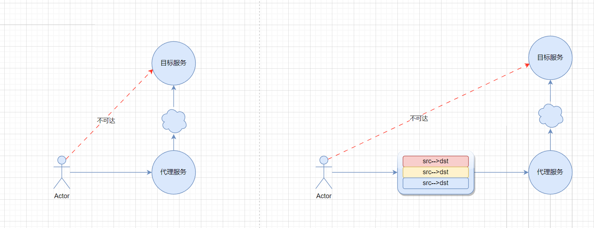

# goproxy

goproxy是golang实现的代理，主要功能是让不支持代理的程序实现代理，不侵入程序，也不修改内核驱动。目前支持以下特性：
- 让不能代理的程序支持代理，无侵入
- 支持多平台多架构部署，windows, linux, adm64， arm64都可以运行

##  架构图


## 使用方法

1. 安装Golang运行环境，编译代码  
例如编译Linux平台的arm64
```CGO_ENABLED=0 GOOS=linux GOARCH=arm64 go build```
2. 修改配置  
```proxy_addr```修改为Sock5代理地址  
```listen_addr```修改为本地监听端口  
```target_addr```修改为远程目标服务 
3. 运行服务  
启动程序后，访问本地监听端口就能访问到远程目标服务

[项目地址](https://github.com/j1187049781/goproxy)